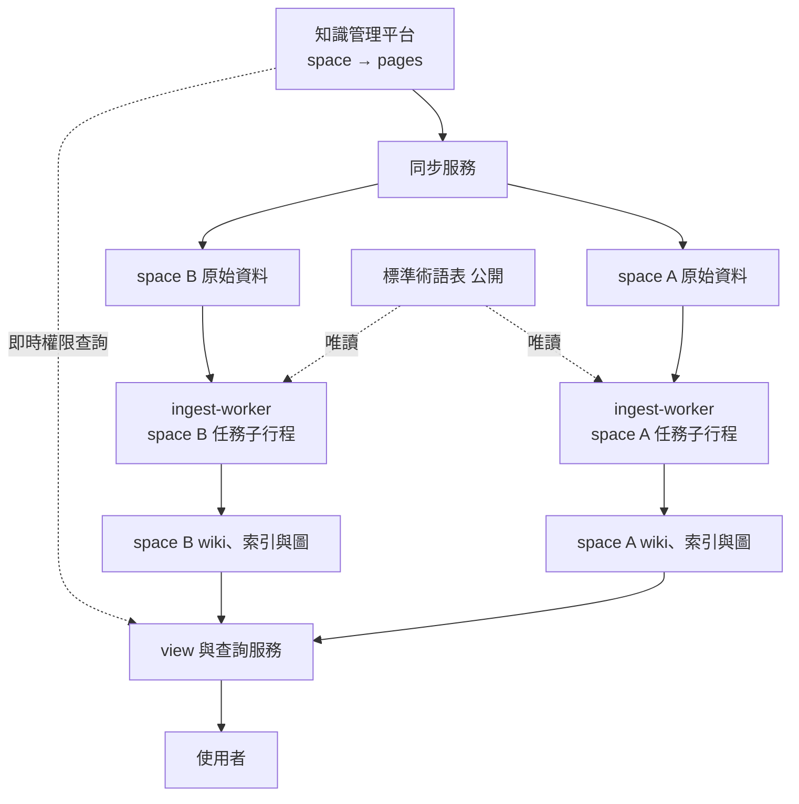

# Knowledge Center 架構

## 1. 目標與範圍

**目標**
- 把內部知識管理平台上各 team 的課程教材，ingest 成結構化、互相連結、可獨立閱讀的 wiki。
- 讀者依其在平台上的權限，看到單一 space 或跨 space 整合後的知識。
- 對資料擁有者（RD team）零額外負擔：一次授權讀取，之後不需要任何簽核或審核。

**非目標**
- 不取代原平台；原平台仍是內容與權限的唯一來源。
- 不提供編輯功能；wiki 內容全部由系統從來源 ingest。
- 不做跨 space 的持久化知識（見 ADR-003）。

## 2. 核心原則

ingest 是函數：`output = LLM(inputs)`。LLM 的輸出無法保證只使用部分輸入，因此系統假設**輸出可能洩漏任何輸入的任何資訊**。由此得出唯一的根本規則（noninterference）：

> 讀者能看某個產物，若且唯若他有權看所有影響過該產物的輸入。

「影響」的範圍包含內容、結構（index 條目、節點 degree、社群劃分）、統計（IDF、排序、去重）、行為（快取命中、回應時間、錯誤訊息），以及存在本身。檢驗任何設計的標準問題：**某個 space 的資料改變時，一個無權讀取該 space 的人看到的東西會不會跟著變？**

## 3. 名詞

| 名詞 | 定義 |
|---|---|
| space | 平台上的權限單位，通常對應一個 team |
| 標籤 labels | space ID 的集合（`frozenset[str]`） |
| 公開 space | 所有系統使用者都可讀的 space（例如 `sp_common`），在標籤模型中沒有特殊地位 |
| 標準術語表 | canonical 概念 ID 與別名，只從公開來源建立，所有使用者可讀 |
| SourcePage | 平台上的一個頁面連同其附件；平台只提供 `updated_date`，無版本號 |
| 投影片 slide | 一個頁面中以分隔符切出的單元，包含文字與圖片 |
| 投影片筆記 slide note | VLM 判讀一張投影片的結構化輸出 |
| claim | 一筆可驗證的敘述，附 provenance |
| space wiki 頁 | 單一 space 內 ingest 出的頁面，分為 concept、entity、course summary、synthesis 四類 |
| filed answer | 使用者主動歸檔的查詢回答，標籤為提問者當下全部可讀 space（ADR-007） |
| view | 依讀者權限從多個 space wiki 頁合成的頁面，只以快取形式存在 |

主題（topic，例如「OPC」）與標籤是兩個獨立欄位。主題用於組織與排序，永遠不用來推論權限。

## 4. 系統總覽



| 元件 | 職責 | 可存取的 space |
|---|---|---|
| 同步服務 | 抓取頁面與附件、加密、依 space 存放、發出 ingest 事件 | 全部（但不做 LLM 處理） |
| ingest-worker | 七步驟 ingest 與 lint；單一服務，每個任務一個子行程（ADR-006） | 每個子行程僅該任務的 space ＋ 標準術語表 |
| view 與查詢服務 | 權限判斷、檢索、跨 space 合成、快取 | 當次請求讀者可讀的 space |
| 模型服務 | 地端 VLM / LLM 推論 | 不保存任何內容 |

## 5. 標籤與權限

```python
Labels = frozenset[str]          # space IDs

def derive(*inputs: Labels) -> Labels:
    return frozenset().union(*inputs)

def can_read(user: User, labels: Labels) -> bool:
    return labels <= platform_acl.readable_spaces(user)   # 短 TTL 快取，fail closed
```

- 原始頁面、投影片、投影片筆記、claim、space wiki 頁：標籤恰為 `{所屬 space}`。
- 標準術語表屬於公開內容，ingest 讀取它不改變輸出的可讀範圍；設定檢查必須確保所有系統使用者都能讀取術語表的來源 space。
- view 與查詢回答：標籤為實際用到的 space wiki 頁標籤聯集（effective labels）。
- 權限細節與失效行為見 ADR-001、ADR-002。

## 6. 資料模型

```
SourcePage    page_id, space_id, updated_date, revision, content_hash, title, parent_id, fetched_at
Slide         slide_ref = page_id#n, page_revision, text, figures[attachment_id]
SlideNote     slide_ref, point, figures[{type, reads, numbers_from_figure, confidence}],
              claims[], concepts[], labels
Claim         claim_id, text, value?, unit?, concept_ids[],
              provenance[{page_id, revision, slide_no, attachment_id?}], labels
Concept       canonical: concept:<slug>（來自公開術語表）；區域：local:<space_id>:<ulid>（名稱存於加密欄位）
SpaceWikiPage page_id = <space_id>:<ulid>, type ∈ {concept, entity, course_summary, synthesis},
              sections, wikilinks[page_id], embedded_figures[], claim_ids[], source_refs[], labels
FiledAnswer   answer, provenance[], source_generations{space_id: n}, labels = 提問者當下全部可讀 space
View          key = (concept_id, effective_labels, generations, template_version)
Figure        attachment_id, space_id；只能經由驗權端點提供
```

每個產物都保留 provenance，使標籤可以重算、可以稽核，並能在來源變動時找出所有受影響的產物。

- `revision` 由同步服務為每個頁面單調遞增，作為 fencing token；`updated_date` 只用於偵測變更，`content_hash`（markdown 與全部附件 hash）用於去重。
- 任何 ID 都不得包含名稱或內容，因為 ID 會進入 log 與 metrics（不變式 7）。
- wikilink 只在同一 space 內解析；解析不到者保留文字、不建立連結。

## 7. Ingest 流程（單一 space 內）

詳見 ADR-005。

1. **解析投影片**：依原始順序切分文字與圖片引用；同一課程的頁面依平台父子關係或命名規則分組。跨 space 的 include 語法只保留引用、不展開；跨 space 連結保留文字、不跟隨。
2. **逐張判讀**：文字與圖片交錯送入 VLM，附課程脈絡。先判斷圖型，再套用 `schema/figure_guides/` 中該圖型的判讀指引。從圖上判讀的數值標記 `numbers_from_figure: true`。
3. **課程層級整合**：依序讀完整門課的投影片筆記，補足脈絡，萃取概念、claims 與關係。
4. **概念對齊**：對應到標準術語表；對不上者建立本 space 的區域概念，不得新增到術語表。
5. **編譯 wiki 頁**：依共用模板撰寫（定義、原理、本 team 實務、常見問題、版本演變、相關概念、來源），以最新課程版本為主，嵌入代表性原圖。
6. **Grounding 驗證**：每句敘述連同其引用的原始投影片文字與圖片一起驗證；無依據者刪除或標示為推論。
7. **建立索引與圖**：文字與圖片 embedding、BM25 統計寫入本 space 的 LanceDB table；頁面、wikilink、來源關係寫入本 space 的 Neo4j。Adamic-Adar、Louvain 社群、degree 只在本 space 內計算。

ingest 是增量的，依 LLM Wiki 模式由 LLM 讀取本 space 的 index 與相關頁面後直接修改既有頁面，版本新舊由 LLM 判斷（ADR-008）。產物記錄其依賴的 `(page_id, revision)`；所有寫入攜帶 revision，由儲存端拒絕過期寫入。同一 space 內 ingest 依序執行，不同 space 之間並行。

**Lint**：定期在單一 space 內檢查矛盾、過時 claim、孤兒頁、缺少頁面的概念與缺漏連結；跨 space 的差異只出現在 view 中。

## 8. 跨 space view

詳見 ADR-003。

1. 讀者開啟概念 X：取得讀者可讀 space，找出這些 space 中存在的 X 的 space wiki 頁。
2. effective labels = 實際找到的頁面標籤聯集。只有一個 space 時直接回傳該頁。
3. 快取 key = `(X, effective_labels, 各 space 世代號碼, 模板版本)`。命中則回傳。
4. 未命中則合成：原理部分整合去重；實務部分依 space 分段並標示來源；多個 space 的敘述或數值不一致時產生「跨 team 差異」段落。
5. 合成結果經 grounding 驗證後寫入快取，標籤為 effective labels。

view 永不回寫為 space wiki 頁，也永不作為 ingest 輸入。跨 space 的區域概念對應在 view 層計算，標籤為相關 space 的聯集。

## 9. 查詢流程

1. 以 SSO 驗證身分，向平台取得可讀 space。
2. 只在可讀 space 的索引中檢索（先過濾）。
3. 從命中頁面沿概念圖擴展一到兩跳，每一步都檢查可讀性。
4. 組裝 context，依 space 分段標示。
5. 模型生成回答，要求標明每個論點的來源 space。
6. 輸出前重新驗證所有引用來源的可讀性；圖片以短時效、驗權的簽章網址提供。
7. 寫入稽核紀錄。

回答不回寫 space wiki。使用者可主動把回答歸檔為 filed answer（ADR-007），其標籤為提問者當下全部可讀 space，只在查詢時作為檢索來源，永不作為 ingest、view 或 lint 的輸入。語意快取的 key 必須包含 effective labels 與世代號碼。

## 10. 變動處理

| 事件 | 行為 |
|---|---|
| 使用者權限變更 | 無需重新處理；下次查詢以新權限計算（最長延遲 = ACL 快取 TTL） |
| space 可見範圍變更 | 同上 |
| 頁面內容更新 | 依 provenance 增量重跑；遞增 space 世代號碼使相關 view 失效 |
| 頁面搬移到其他 space | 先在舊 space 移除所有衍生產物（優先處理），再於新 space 重新 ingest |
| 頁面刪除或封存 | 移除只依賴它的產物，重新 ingest 多來源產物 |
| 頁面含頁面層級權限限制 | 隔離，不 ingest（見 ADR-001） |

原則：讓資料變得更難看到的事件優先處理；不確定時拒絕。

## 11. Kubernetes 部署

| 元件 | 形式 | 隔離 |
|---|---|---|
| 同步服務 | CronJob（`concurrencyPolicy: Forbid`），以 getPages 比對 `updated_date` | 只寫入原始資料儲存與佇列 |
| ingest-worker | 單一 Deployment（ADR-006） | 每個任務一個子行程，只持有該 space 的 Vault 短時效憑證；NetworkPolicy 只允許儲存、模型服務、Vault、NATS；對外無出口；建議 gVisor 或 Kata runtime |
| 佇列 | NATS JetStream，每 space 一個 subject（`kc.page.<space_id>`） | ACL 限定消費者；訊息只含 ID；同一 space `max_ack_pending=1` |
| 儲存 | MinIO 依 space 分 bucket；MongoDB 依 space 分 database；LanceDB 依 space 分 bucket；Neo4j 每 space 一個 instance；跨 space 衍生物在 `kc_derived` | Vault 依 space 發放憑證與 transit 金鑰；MongoDB 內容欄位於應用層加密；`kc_derived` 的資料金鑰由標籤中每個 space 的金鑰層層包裝 |
| 模型服務 | GPU 節點上的推論服務 | 關閉請求內容 log；視需要依 space 隔離 prefix cache |
| view 與查詢 | 無狀態 Deployment | 依每次請求的讀者權限取得解密金鑰 |

**可觀測性規則**：log、trace、metrics（包含 metric label）只記錄 ID 與數值，不得包含內容、頁面標題或概念名稱。集中式 log 系統是跨 space 的共用設施。

**管理邊界**：金鑰放叢集外 KMS，不放 k8s Secret；限制 production namespace 的 exec；啟用稽核。

## 12. 安全控制總覽

| 層 | 控制 |
|---|---|
| 資料 | per-space 加密金鑰；管理者無法解密；log 與 trace 同等保護 |
| ingest | 單一 space 沙盒；無對外網路；地端模型 |
| view 與查詢 | 即時權限、先過濾、快取 key 含標籤、輸出前驗證、不回寫 |
| 圖片 | 只經驗權端點提供，無公開靜態網址 |
| 透明度 | 各 space 擁有者可查詢本 space 內容的使用紀錄（誰、何時、哪些 claims），不含查詢原文與其他 space 內容 |

## 13. 測試策略

- **合成測試集**：`tests/fixtures/synthetic_litho_testset/`，開發期間唯一的資料來源。
- **應用層 leak 測試**：以四種模擬使用者執行 probe queries 與 view，canary 出現在不該出現的輸出即失敗；比對「無權限」與「查無資料」回應的一致性。
- **基礎設施 leak 測試**：以 space A 任務子行程的憑證讀取 space B 的儲存必須失敗；對外連線必須失敗；ingest 後收集的 log 中不得出現 canary。
- **品質評估**：對照 `gold/slides.json`、`gold/cross_space_meef.json`，追蹤數值容差命中率、概念對齊正確率與 grounding 通過率。
- leak 測試為零容忍，列入 CI 必要條件；品質指標可逐步提升。

## 14. 里程碑

| 里程碑 | 內容 | 完成標準 |
|---|---|---|
| M0 | 標籤函式庫、`can_read`、模擬平台 API、本機叢集骨架、leak 測試框架 | 標籤 property-based 測試通過；四種模擬使用者權限正確 |
| M1 | 同步服務、依 space 加密儲存、Vault per-space role、ingest-worker 子行程隔離與 NetworkPolicy | `updated_date` 變更偵測與 revision 正確；include 未展開；基礎設施隔離測試通過 |
| M2 | ingest 第 1、2 步 | `gold/slides.json` 數值在容差內、圖型分類正確 |
| M3 | ingest 第 3 至 7 步（含 Neo4j 圖） | 概念對齊正確；OPC 頁以 2.5 為現行值 |
| M3.5 | 單一 space lint | 合成測試集中的矛盾與孤兒頁被檢出 |
| M4 | 單一 space 查詢 | `probe_queries.json`、`leak_probes.json` 全部通過 |
| M5 | 跨 space view 與快取 | `cross_space_meef.json` 四種使用者預期成立 |
| M5.5 | filed answer（ADR-007） | 提問夾帶第三個 space canary 的 leak 測試通過 |
| M6 | 變動處理與強化（刪除時重跑 grounding，見 ADR-008） | `sync_scenarios.json` 三種情境成立；上線前必要條件 |

M4、M5 只提供 API；讀者介面另立里程碑。

## 15. 待確認事項

- 平台是否支援頁面層級的權限限制（目前假設不支援，遇到則隔離，見 ADR-001）。
- 平台是否提供權限變更的 webhook（有則用於主動失效 ACL 快取）。
- 課程 markdown 的實際格式（投影片分隔符、圖片引用、include 語法）。
- 地端 VLM 的選型與 GPU 資源規劃。
- 平台以 `updated_date` 偵測變更，需確認附件更新時該欄位必定改變（目前假設會）。

## 16. 已知缺口

- **M1–M5 不處理頁面刪除與搬移**：頁面刪除或搬到更嚴格的 space 後，舊內容仍留在原 space wiki。M6 必須完成，否則不得上線。
- **ingest 的 space 隔離為程式與行程層級**（ADR-006）：防程式 bug，不防 ingest-worker 主行程被入侵。
- **LanceDB 的 per-space 加密**：待調查 Lance／object_store 是否支援 SSE-C；若不支援，LanceDB 僅有 bucket 權限隔離與 SSE。
- **Neo4j Community 每 space 一個 instance**：正式環境是否改用 Enterprise 多資料庫視授權與 space 數量決定。
- **MinIO 社群版**已進入維護模式，正式環境 object store 待定。
